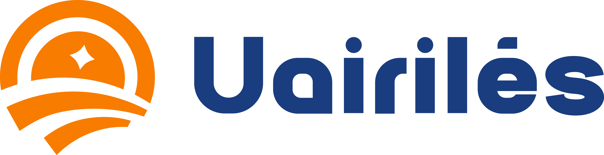

  

---

## 🇧🇷 Uairilés — PT-BR

**Transformamos redes Wi-Fi em canais inteligentes de comunicação e publicidade local.**

A Uairilés nasceu com uma missão simples: **levar conectividade profissional e marketing digital acessível para os negócios locais.**  
A ideia surgiu quando percebemos um padrão — muitos comércios locais até gostariam de oferecer Wi-Fi de qualidade para seus clientes, mas esbarram no custo dos equipamentos e suporte técnico qualificado.

Foi aí que mudamos a lógica do jogo: em vez de cobrar dos comerciantes pela infraestrutura, **instalamos os equipamentos por conta própria e monetizamos o Wi-Fi por meio de anúncios locais.**

### 🧩 Como funciona?

A Uairilés é uma plataforma que une tecnologia de rede com veiculação de anúncios de forma estratégica:

- Os **usuários** se conectam ao Wi-Fi gratuito e veem conteúdos relevantes: notícias, vagas de emprego, classificados e, claro, anúncios do comércio local.
- Os **anunciantes** ganham visibilidade real em canais simultâneos:
  - 📱 **Hotspot de Wi-Fi:** banners e vídeos na página de acesso.
  - 🖥️ **Totens com TV digital:** exibem propagandas em vídeo nos totens instalados em locais parceiros.

Nosso foco é **ser relevante tanto para quem anuncia quanto para quem consome.** Por isso criamos um ecossistema simples, funcional e útil — especialmente no interior, onde a internet móvel muitas vezes é limitada.

### 🚀 Visão de futuro

A longo prazo, a Uairilés pretende **licenciar sua tecnologia para empreendedores locais em outras cidades**, permitindo que mais pessoas criem negócios de mídia digital regional usando nossa plataforma.

---

**Uairilés – conectando pessoas, fortalecendo negócios.**

---

## 🇺🇸 Uairilés — EN

**We turn Wi-Fi networks into smart channels for local communication and advertising.**

Uairilés was born from a simple mission: **to bring professional connectivity and accessible digital marketing to local businesses.**  
The idea came when we noticed a pattern — many small businesses want to offer quality Wi-Fi to their customers but are held back by the cost of professional equipment and qualified technical support.

So we flipped the model: instead of charging businesses for infrastructure, **we install the equipment ourselves and monetize the Wi-Fi through local ads.**

### 🧩 How it works

Uairilés is a platform that combines networking technology with strategic ad placement:

- **Users** connect to free Wi-Fi and see relevant content: local news, job listings, classifieds, and of course, ads from nearby businesses.
- **Advertisers** gain real exposure across multiple channels:
  - 📱 **Wi-Fi hotspot:** banners and video ads on the access portal.
  - 🖥️ **Digital signage totems:** video ads shown on screens at partner locations.

Our goal is to **be relevant to both advertisers and users.** That’s why we created a simple, practical ecosystem — especially valuable in smaller towns where mobile data is often limited or unreliable.

### 🚀 Looking ahead

In the long term, Uairilés aims to **license its technology to local entrepreneurs in other cities**, empowering more people to build their own regional digital media businesses using our platform.

---
 
**Uairilés – connecting people, strengthening local business.**
